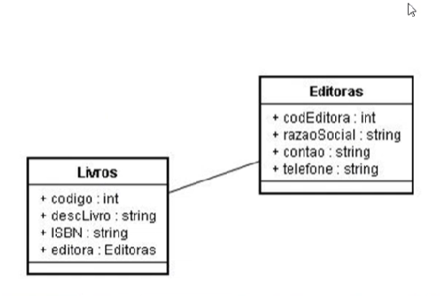
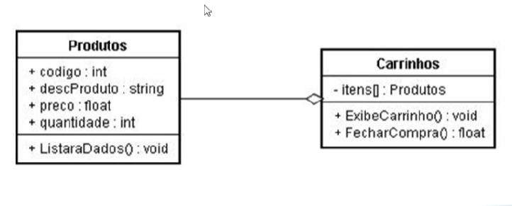

# Associação
 É o tipo mais básico de relacionamento, representando uma conexão entre duas classes sem dependência de existência. Ou seja, os objetos podem existir independentemente um do outro.
Cardinalidade: Define a quantidade de objetos de cada classe que podem participar do relacionamento. Pode ser um para um (1:1), um para muitos (1:N) ou muitos para muitos (N:N).


```c#
public class Mago
{
    public string Nome { get; set; }
    public List<Aprendiz> Aprendizes { get; set; }

    public Mago(string nome)
    {
        Nome = nome;
        Aprendizes = new List<Aprendiz>();
    }
}

public class Aprendiz
{
    public string Nome { get; set; }
    public Mago Mestre { get; set; }

    public Aprendiz(string nome)
    {
        Nome = nome;
    }
}
```
# Agregação

É um tipo especial de associação que representa um relacionamento "tem um". A classe "todo" (agregada) contém a classe "parte" (agregada), mas a parte pode existir independentemente do todo.

Dependência de existência: A parte não depende do todo para existir.
Ciclo de vida: A parte pode ter um ciclo de vida diferente do todo.
Compartilhamento: Uma parte pode ser agregada a vários todos.

Um CarrinhoDeCompras pode ter um ou mais Produtos.
Um Produto não precisa de um CarrinhoDeCompras.
Relação "tem um": um carrinho tem vários produtos.
O ciclo de vida do Produto não depende do CarrinhoDeCompras.
```c#
public class Produto {
    public int cod_produto;
    public string desc_produto;
    public string preco_produto;

}

public class CarrinhoDeCompras {
    public  Produto[] produtos;
    public void ExibeCarrinho();
}
```
# Composição
Toda vez que dizemos que a relação entre duas classe é de composição estamos dizendo que uma dessas classe (a Parte) está contida na outra (o Todo) e a parte não vive/não existe sem o todo.
```c#
public class Capitulo
{
    public int Numero { get; set; }
    public string Titulo { get; set; }

    public Capitulo(int numero, string titulo)
    {
        Numero = numero;
        Titulo = titulo;
    }
}

public class Livro
{
    public string Titulo { get; set; }
    public string Autor { get; set; }
    public List<Capitulo> Capitulos { get; set; }

    public Livro(string titulo, string autor)
    {
        Titulo = titulo;
        Autor = autor;
        Capitulos = new List<Capitulo>();
    }

    public void AdicionarCapitulo(Capitulo capitulo) => Capitulos.Add(capitulo);

    public string ObterTexto()
    {
        var texto = $"**{Titulo}**\n\n{Autor}\n\n";
        foreach (var capitulo in Capitulos)
        {
            texto += $"**Capítulo {capitulo.Numero}: {capitulo.Titulo}**\n\n";
        }
        return texto;
    }
}

public class Program
{
    public static void Main(string[] args)
    {
        var livro = new Livro("A Revolução dos Bichos", "George Orwell");

        livro.AdicionarCapitulo(new Capitulo(1, "O Velho Major"));
        livro.AdicionarCapitulo(new Capitulo(2, "A Rebelião"));

        var texto = livro.ObterTexto();

        Console.WriteLine(texto);
    }
}
```c#