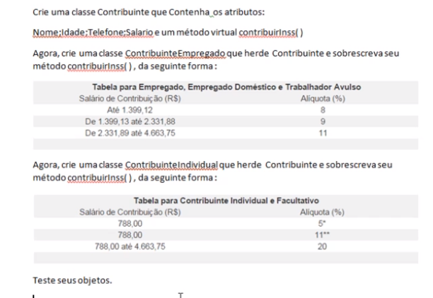

## Exercise 01: (01 -10)

## Exercise 2: Design a Stopwatch (01-05)
Design a class called Stopwatch. The job of this class is to simulate a stopwatch. It should
provide two methods: Start and Stop. We call the start method first, and the stop method next.
Then we ask the stopwatch about the duration between start and stop. Duration should be a
value in TimeSpan. Display the duration on the console.
We should also be able to use a stopwatch multiple times. So we may start and stop it and then
start and stop it again. Make sure the duration value each time is calculated properly.
We should not be able to start a stopwatch twice in a row (because that may overwrite the initial
start time). So the class should throw an InvalidOperationException if its started twice.

Educational tip: The aim of this exercise is to make you understand that a class should be
always in a valid state. We use encapsulation and information hiding to achieve that. The class
should not reveal its implementation detail. It only reveals a little bit, like a blackbox. From the
outside, you should not be able to misuse a class because you shouldn’t be able to see the
implementation detail.

# Exercise 3: Design a StackOverflow Post (01-05)
Design a class called Post. This class models a StackOverflow post. It should have properties
for title, description and the date/time it was created. We should be able to up-vote or down-vote
a post. We should also be able to see the current vote value. In the main method, create a post,
up-vote and down-vote it a few times and then display the the current vote value.
In this exercise, you will learn that a StackOverflow post should provide methods for up-voting
and down-voting. You should not give the ability to set the Vote property from the outside,
because otherwise, you may accidentally change the votes of a class to 0 or to a random
number. And this is how we create bugs in our programs. The class should always protect its
state and hide its implementation detail.
Educational tip: The aim of this exercise is to help you understand that classes should
encapsulate data AND behaviour around that data. Many developers (even those with years of
experience) tend to create classes that are purely data containers, and other classes that are
purely behaviour (methods) providers. This is not object-oriented programming. This is procedural programming. Such programs are very fragile. Making a change breaks many parts
of the code.

## Exercise 5: Design a Stack (01-08)
A Stack is a data structure for storing a list of elements in a LIFO (last in, first out) fashion.
Design a class called Stack with three methods.
void Push(object obj)
object Pop()
void Clear()
The Push() method stores the given object on top of the stack. We use the “object” type here so
we can store any objects inside the stack. Remember the “object” class is the base of all classes
in the .NET Framework. So any types can be automatically upcast to the object. Make sure to
take into account the scenario that null is passed to this object. We should not store null
references in the stack. So if null is passed to this method, you should throw an
InvalidOperationException. Remember, when coding every method, you should think of all
possibilities and make sure the method behaves properly in all these edge cases. That’s what
distinguishes you from an “average” programmer.
The Pop() method removes the object on top of the stack and returns it. Make sure to take into
account the scenario that we call the Pop() method on an empty stack. In this case, this method
should throw an InvalidOperationException. Remember, your classes should always be in a valid
state and used properly. When they are misused, they should throw exceptions. Again, thinking
of all these edge cases, separates you from an average programmer. The code written this way
will be more robust and with less bugs.
The Clear() method removes all objects from the stack.
We should be able to use this stack class as follows:
var stack = new Stack();
stack.Push(1);
stack.Push(2);
stack.Push(3);
Console.WriteLine(stack.Pop());
Console.WriteLine(stack.Pop());
Console.WriteLine(stack.Pop());
The output of this program will be

Note: The downside of using the object class here is that if we store value types (eg int, char,
bool, DateTime) in our Stack, boxing and unboxing occurs, which comes with a small
performance penalty. In my C# Advanced course, I’ll teach you how to resolve this by using
generics, but for now don’t worry about it.

Real-world use case: Stacks are very popular in real-world applications. Think of your browser.
As you navigate the web, the address of each page you visit is stored in a stack. As you click the
Back button, the most recent address is popped. This is because of the LIFO behaviour of stack.

## Exercise 6: Design a workflow engine (01-10)
Design a workflow engine that takes a workflow object and runs it. A workflow is a series of steps
or activities. The workflow engine class should have one method called Run() that takes a
workflow, and then iterates over each activity in the workflow and runs it.
We want our workflows to be extensible, so we can create new activities without impacting the
existing activities.
Educational tip: we should represent the concept of an activity using an interface. Each activity
should have a method called Execute(). The workflow engine does not care about the concrete
implementation of activities. All it cares about is that these activities have a common interface:
they provide a method called Execute(). The engine simply calls this method and this way it
executes a series of activities in sequence.
The aim of this exercise is to help you understand how you can use interfaces to design
extensible applications. You change the behaviour of your application by creating new classes,
rather than changing the existing classes. You’ll also see polymorphic behaviour of interfaces.
Real-world use case: in a real-world application you may use a workflow in a scenario like the
following:
1- Upload a video to a cloud storage.
2- Call a web service provided by a third-party video encoding service to tell them you have a
video ready for encoding.
3- Send an email to the owner of the video notifying them that the video started processing.
4- Change the status of the video record in the database to “Processing”.
Each of these steps can be represented by an activity. For the purpose of this exercise, do not
worry about these complexities. Simply use Console.WriteLine() in each of your activity classes.
Your focus should be on sending a workflow to the workflow engine and having it run the
workflow and all the activities inside it. We don’t care about the actual activities. 